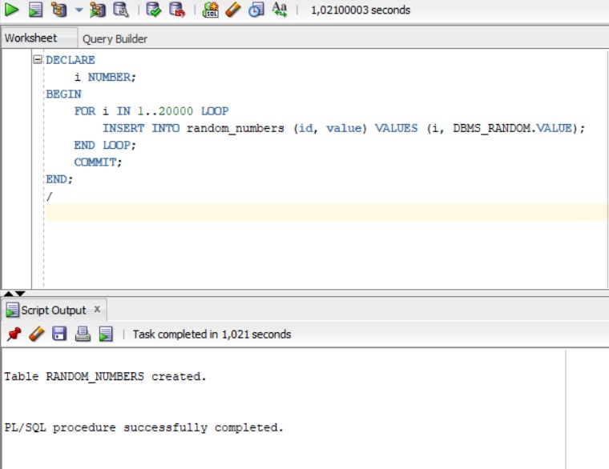
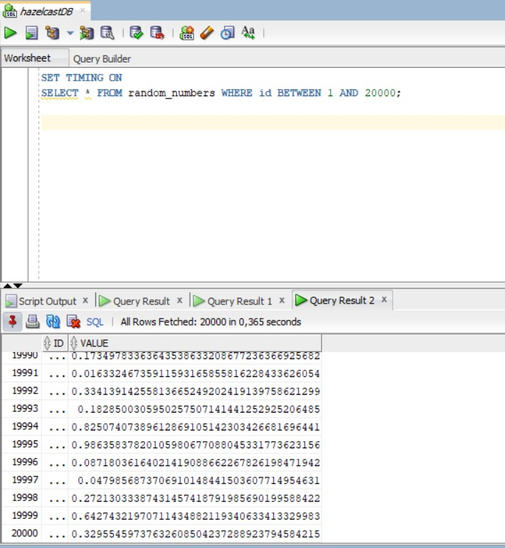
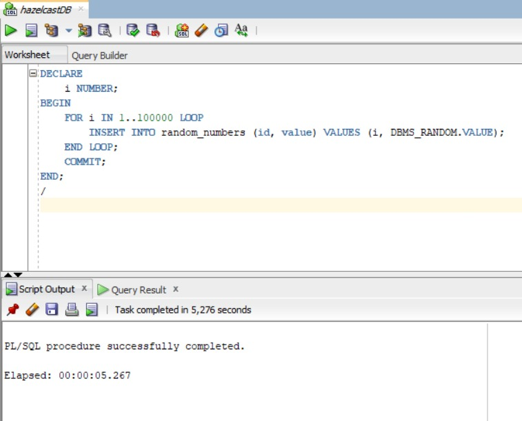
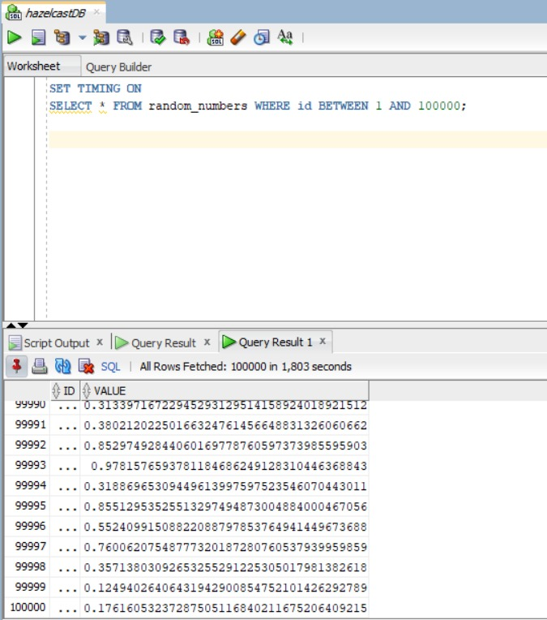
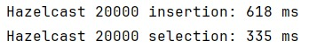
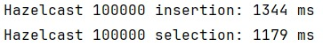

# Hazelcast vs Oracle Performance Test

This repository contains a Java project that demonstrates the performance of Hazelcast for caching and retrieving operations. The project uses Maven as a build tool and Hazelcast as the primary caching solution.

## Overview

The purpose of this project is to benchmark the performance of Hazelcast in comparison to traditional database operations. This is achieved by performing a series of insertions and selections on a Hazelcast map and comparing these times to similar operations in a SQL database.

## Prerequisites

- Java 11 or higher
- Maven
- Hazelcast 5.3.6

## How to Run

1. Clone the repository to your local machine.
2. Navigate to the project directory.
3. Run `mvn clean install` to build the project.
4. Execute `java -jar target/Hazelcast-1.0-SNAPSHOT.jar` to start the performance test.

## Performance Results

### SQL Database Performance

#### 20,000 Records

| Operation       | Time   | Screenshot |  Operation       | Time   | Screenshot |
|-----------------|--------|------------| -----------------|--------|------------|
| **Insertion**   | 1021 ms|  | **Selection**   | 365 ms |  |

#### 100,000 Records

| Operation       | Time   | Screenshot | Operation       | Time   | Screenshot |
|-----------------|--------|------------|-----------------|--------|------------|
| **Insertion**   | 5276 ms|  | **Selection**   | 1803 ms|  |

### Hazelcast Performance

| Operation       | Time                        | Screenshot                                  |
|-----------------|------------------------------|---------------------------------------------|
| **20k Performance** | 618 ms   335 ms  |  |
| **100k Performance** | 1344 ms   1179 ms  |  |

## Conclusion

The performance tests indicate that Hazelcast provides a significant improvement in speed for both insertion and selection operations compared to traditional SQL database operations. This demonstrates the effectiveness of Hazelcast as a caching solution for high-performance applications.
